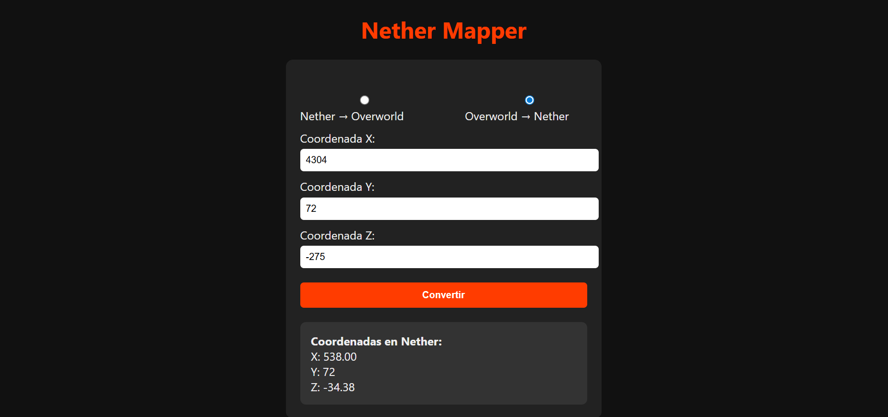

# 🧭 Nether Mapper

Nether Mapper es una herramienta web para jugadores de Minecraft que permite convertir coordenadas entre el Nether y el Overworld de forma instantánea.

## 🚀 Características
- Conversión precisa de coordenadas Nether ↔ Overworld
- Interfaz simple y responsiva (funciona en celular o PC)
- Hecho con HTML, CSS y JavaScript puro

## 📌 Próximas funciones (en desarrollo)
- Guardado de coordenadas personalizadas
- Modo oscuro
- App para celulares
